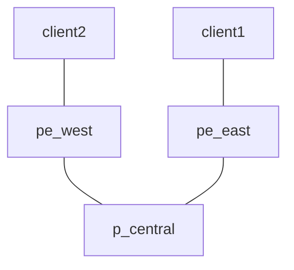

# clab-iol-mpls-l3vpn

## Overview

A simple MPLS Service Provider (SP) network setup for facilitating MPLS L3VPN service connectivity using [CONTAINERlab](https://containerlab.dev/) and [IOL](https://developer.cisco.com/docs/modeling-labs/iol/) nodes to enable Layer 3 connectivity between two clients.

## Requirements

- [CONTAINERlab](https://containerlab.dev/install/)
  - _The [CONTAINERlab](https://containerlab.dev/install/) installation guide outlines various installation methods. This lab assumes all [pre-requisites](https://containerlab.dev/install/#pre-requisites) (including Docker) are met and CONTAINERlab is installed via the [install script](https://containerlab.dev/install/#install-script)._
- Cisco IOL [image](https://containerlab.dev/manual/kinds/cisco_iol/) >= 17.12.01
  - Adjust the ```topology.kinds.cisco_iol.image``` value in [setup.yml](setup.yml) to reflect the proper image and tag

```shell
$ docker image ls | grep iol
vrnetlab/cisco_iol         l2-17.12.01    002115d03152   5 weeks ago     607MB
vrnetlab/cisco_iol         17.12.01       3c4532f8634c   5 weeks ago     704MB
```

- Python 3

## Topology



## Resources

### IP Assignments

_**NOTE**: The Overlay/VTEP assignments for spine01/spine02 are not actually implemented, or even required, since our VTEP's in this lab are on leaf01/leaf02/leaf03. The assignments are therefore just for consistency purposes_

| Scope              | Network       | Sub-Network    | Assignment     | Name               |
| ------------------ | ------------- | -------------  | -------------  | -------            |
| Management         | 10.0.0.0/24   |                | 10.0.0.2/24    | pe_east            |
| Management         | 10.0.0.0/24   |                | 10.0.0.3/24    | p_central          |
| Management         | 10.0.0.0/24   |                | 10.0.0.4/24    | pe_west            |
| Router ID (lo0)    | 10.10.10.0/24 |                | 10.10.10.1/32  | pe_east            |
| Router ID (lo0)    | 10.10.10.0/24 |                | 10.10.10.2/32  | p_central          |
| Router ID (lo0)    | 10.10.10.0/24 |                | 10.10.10.3/32  | pe_west            |
| P2P Links          | 10.1.0.0/24   | 10.1.0.0/31    | 10.1.0.0/31    | pe_west::p_central |
| P2P Links          | 10.1.0.0/24   | 10.1.0.0/31    | 10.1.0.1/31    | p_central::pe_west |
| P2P Links          | 10.1.0.0/24   | 10.1.0.2/31    | 10.1.0.2/31    | pe_east::p_central |
| P2P Links          | 10.1.0.0/24   | 10.1.0.2/31    | 10.1.0.3/31    | p_central::pe_east |

### Underlay ASN Assignments

| ASN   | Device    |
| ----- | --------- |
| 65536 | p_central |
| 65536 | pe_east   |
| 65536 | pe_west   |

## Deployment

Clone this repsoitory and start the lab

```shell
git clone https://github.com/dbono711/clab-iol-mpls-l3vpn.git
cd clab-iol-mpls-l3vpn
make all
```

**_NOTE: CONTAINERlab requires SUDO privileges in order to execute_**

- Initializes the ```setup.log``` file
- Creates the [CONTAINERlab network](setup.yml) based on the [topology definition](https://containerlab.dev/manual/topo-def-file/)

## Cleanup

Stop the lab, tear down the CONTAINERlab containers

```shell
make clean
```

## Logging

All activity is logged to a file called ```setup.log``` at the root of the repository.

## Authors

- Darren Bono - [darren.bono@att.net](mailto://darren.bono@att.net)

## License

This project is licensed under the MIT License. See [LICENSE](LICENSE) for details
